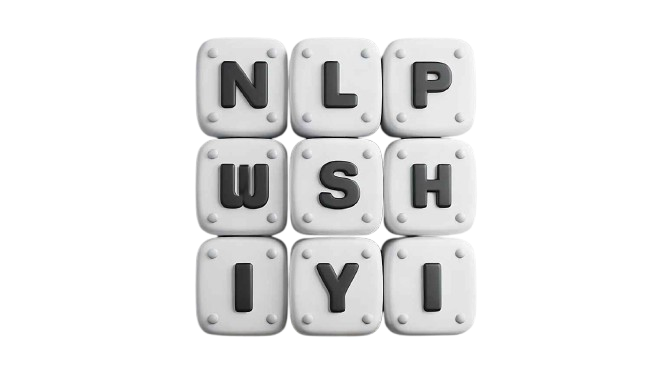

# Understanding Natural Language Processing with Me!


Hi, I’m Shiyi (about [me](https://shiyis.github.io/nlpwme/modules/aboutme/)). Welcome to my technical blog. I will be documenting my journey of learning Natural Language Processing here. I will be presenting everything I have learned so far, including important concepts, necessary code snippets, and more. I am by no means an expert in this subject, but I have gone through extensive studies and training in the fields and subfields related to have a good grasp of what’s important.


Areas that I have dabbled in,

```
→ General Linguistics
→ Symbolic Computational Linguistics
→ Statistical Natural Language Processing
→ State of the Art Large Language Modeling
```


### **The Subject Matter**

What do we mean by Natural Language Processing? If we do a little googling and researching, it's very intuitive that natural language processing involves a set of solutions to various natural human language tasks. The most common ones are

```
→ Sentiment analysis
→ Machine translation 
→ Word-sense disambiguation 
→ Named-entity recognition 
→ Topic modeling 
→ Document classification 
→ Question answering 
```


### **A Little Bit Of History**

The history of Computational Linguistics dates back to the 40s to 50s. So, it's not very long ago that the field that has created ChatGPT or any form of AI that is so commonly adopted in every aspect of our lives now started to have its very first ancestral ideation. It's still a fairly new and young field with infinite possibilities up for exploration.

Before diving in, first we have to ask ourselves what exactly is artificial intelligence (AI)?

Well, according to the official definition extracted out of John McCarthy's 2004 [paper](https://www-formal.stanford.edu/jmc/whatisai.pdf) listed on IBM's [website](https://www.ibm.com/topics/artificial-intelligence),

```
🤖️ "It is the science and engineering of making intelligent 
machines, especially intelligent computer programs. It is 
related to the similar task of using computers to understand
human intelligence, but AI does not have to confine itself 
to methods that are biologically observable."
```

So if it's to understand human intelligence, we need to know humans gain information and how human intelligence, or the brain, really works both through physiology and psychology,

```plaintext
💡 Two Important Sources of Knowledge: Rationalism and Empiricism. 
The first acquires knowledge through reasoning and logic, while 
the second through experience and experimentation.
```

Below are some important notes with respect to the **historical timeline** of the development of Computational Linguistics and NLP and how it all started from one of these two principles and gradually transitioned to the other (rationalism / computationalism to empiricalism / connectionism; although computationalism is not always symbolic; namely it also incorporates empirical evidence):

\textoutput{cards}

<!-- 
### Topics That Might Be Relevant (Cont. updated)

- Topic 0: Information Theory
  - [Subtopic 0: Noisy Channel Model](./modules/noisy-channel-model)
  - [Subtopic 1: Cryptography](./modules/cryptography)
  - [Subtopic 2: Mutual Information](./modules/mutual-info)
  - [Subtopic 3: Information Retrieval](./modules/info-ret)
- Topic 1: Math and Physics
  - [Subtopic 0: Calculus](./modules/calculus)
    - [Concept 1: Derivatives](./modules/calculus)
    - [Concept 2: Divergence](./modules/calculus)
    - [Concept 3: Quadratic Approximation](./modules/calculus)
  - [Subtopic 1: Linear Algebra](./modules/linear-alg)
    - [Concept 1: Jacobian Matrices](./modules/linear-alg)
    - [Concept 2: Vector Processing](./modules/linear-alg)
    - [Concept 3: Single Valued Decomposition](./modules/linear-alg)
    - [Concept 4: Linear Transformation](./modules/linear-alg)
  - [Subtopic 2: Formal Logic](./modules/logic)
    - [Concept 1: Propositional Logic](./modules/logic)
    - [Concept 2: Lambda Calculus](./modules/logic)
    - [Concept 3: Formalism](./modules/logic)
  - [Subtopic 3: Statistics and Probability](./modules/stat-prob)
    - [Concept 1: Conditional Probability](./modules/stat-prob)
    - [Concept 2: Variance and Expectation](./modules/stat-prob)
    - [Concept 3: Markov Chain Monte Carlo](./modules/stat-prob)
    - [Concept 4: Principle Component Analysis](./modules/stat-prob)
    - [Concept 5: Bayesian Simulation](./modules/stat-prob)
  - [Subtopic 4: Discrete Math](./modules/disrete-math)
    - [Concept 1: Turing Machine](./modules/disrete-math)
    - [Concept 2: Finite State Automata](./modules/disrete-math)
    - [Concept 3: Graph](./modules/disrete-math)
  - [Subtopic 5: Thermodynamics](./modules/therm)
    - [Concept 1: Entropy](./modules/therm)
    - [Concept 2: Classical Thermodynamics](./modules/therm)
- Topic 2a: Computationalism
  - [Subtpoic 0: Chomsky Hierarchy](./modules/chomsky-hierarchy)
  - [Subtopic 1: Context Free Grammar](./modules/context-free-grammar)
  - [Subtopic 2: Finite State Automata](./modules/finite-stat-automata)
  - [Subtopic 3: Linguistic Trees](./modules/linguistic-trees)
  - [Subtopic 4: Parsing](./modules/parsing)
  - [Subtopic 5: Hidden Markov Model](./modules/hidden-markov-model)
  - [Subtopic 6: Word Net](./modules/word-net)
  - [Subtopic 7: Universal Dependencies](./modules/universal-dependencies)
- Topic 2b: Connectionism
  - [Subtopic 2a: Tensors](./modules/2a-pytorch-tensors)
  - [Subtopic 2b: Automatic Differentiation](./modules/2b-automatic-differentiation)
  - [Subtopic 3: Loss functions for classification](./modules/3-loss-functions-for-classification)
  - [Subtopic 4: Optimization for Deep Learning](./modules/4-optimization-for-deep-learning)
  - [Subtopic 5: Stacking layers](./modules/5-stacking-layers)
  - [Subtopic 6: Convolutional Neural Network](./modules/6-convolutional-neural-network)
  - [Subtopic 7a: Embedding layers and dataloaders](./modules/7a-embedding-layers-dataloaders)
  - [Modules 8: Autoencoders and Transformers](./modules/8-autoencoders)
  - [Subtopic 9: Generative Adversarial Networks](./modules/9-generative-adversarial-networks)
  - [Subtopic 10: Recurrent Neural Networks](./modules/10a-recurrent-neural-networks) -->
